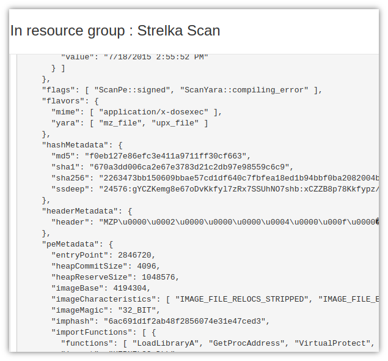

strelka
========

Strelka is a real time scalable file scanning framework. See  https://github.com/target/strelka


It can be easily integrated with Trisul NSM with the following changes.

1. Install the [Save Binaries Trisul APP](https://github.com/trisulnsm/apps/tree/master/analyzers/save_binaries)  which dumps extracted files (of any size) into `/tmp/savedfiles` on the Trisul-Probe nodes
2. Edit  the `/opt/strelka/etc/dirstream/dirstream.yml` to watch the directory `/tmp/savedfiles`
````
  workers:
      - directory:
	          directory: "/tmp/savedfiles"
			          source: null
````
3. Then follow the instructions on [strelka](https://github.com/target/strelka) to run the servers and dirstream
Example
````
# on trisul-probe (the client)
/usr/local/bin/strelka_dirstream.py -d -c etc/dirstream/dirstream.yml
# on the server
/usr/local/bin/strelka
````

That ought to be enough to get started.  The results of the file scanning can be found in the JSON output files in `/var/log/strelka`


## Enter this little LUA script `strelka_resource.lua`

We want to pull the results back into the Trisul pipeline. All the `strelka-json.lua` script does is create a new Trisul resource type called `strelka-scan` and pushes the JSON documents back into the Trisul streaming pipeline. You can then do alerting, further analysis, metrics on the strelka JSON. One example might be to alert if you trip a MMBOT malware prediction threshold. Get creative. 


## Using 

Once it is integrated and running, the Strelka Scan results will be sucked into Trisul Resources.  

### A new resource type Strelka Scan  


### Search / view scan results 

Clicking on Strelka Scan resource, will take you to the Resources Page. Where you will see all the scan results, then you can search , view , download them

The following screenshot shows you JSON scan output of an EXE file




