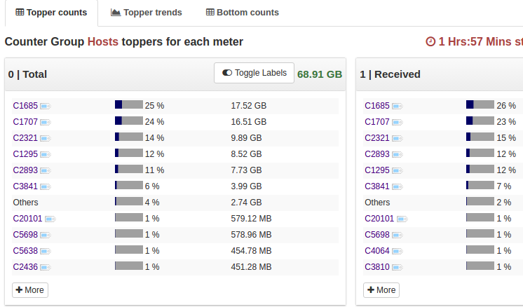

LANL-Cyber Dataset 
=============

## Processing the dataset 

LANL has published about 58 days of network flow data for cyber security purposes at
https://csr.lanl.gov/data/cyber1/

The `flows.txt.gz` file is a 1.1G dump that contains netflow like data in the format

`time,duration,source computer,source port,destination computer,destination port,protocol,packet count,byte count`

The IP addresses and ports are anonymized using plain strings, for example this is what a line from the logfile looks like 

````
1,9,C3090,N10471,C3420,N46,6,3,144
1,9,C3538,N2600,C3371,N46,6,3,144
2,0,C4316,N10199,C5030,443,6,2,92
````

With the Trisul API you can even process these types of flow records by being a little clever converting the string ids into IP addresses and Port numbers. 

## Running this script 

This is an [input-filter](https://www.trisul.org/docs/lua/inputfilter.html) script type that processes the text file flows.txt.


> *Example* We will create a new context called `lanl1` and process the file in that context. A context is a separate database [more](https://www.trisul.org/docs/ug/domain/index.html#contexts)


### Instructions  

````
# download the two *.lua files in this directory
# or any other directory that is readable by the trisul.trisul user 
#
cd /usr/local/share/trisul-probe
wget .. put the two lua file in this place 


# create a new context
#
trisulctl_probe create context lanl1

# start the lanl1 context on the hub node (start database)
#
trisulctl_probe start context lanl1@hub0 


# run Trisul manually , notice mode=lua , in=the-lua-script , args=the-flows.txt-file
#
trisul -nodemon /usr/local/etc/trisul-probe/domain0/probe0/context_lanl1/trisulProbeConfig.xml \
  -mode lua \
   -in /usr/local/share/trisul-probe/lanlflow.lua \
    -args /trisulroot/flows.txt

````


## Checking Progress 


If all goes well, the import will start and may take upwards of 30 minutes. 

If the script doesnt run, check the log files 

````
cd /usr/local/var/log/trisul-probe/domain0/probe0/context_lanl1
tailf ns-001.log

````

or use the Trisul probe macros to check the progress 

````
source /usr/local/share/trisul-probe/trisbashrc lanl1
tailf.ns
````


## How lanlflow.lua works

The lanlflow.lua script is an *inputfilter* LUA script that can drive the Trisul Network Analytics pipeline. 
What we do in this script is convert the strings into IP addresses. We simply hash them to a 32 bit number and 16 bit number and use that.  The script then uses the Engine methods to update various metrics.


## Screenshots

Some samples from the "Retro Analysis" tools 

### Top apps 


### Top hosts by total , xmit, recv, connections  



### Trends over time 


